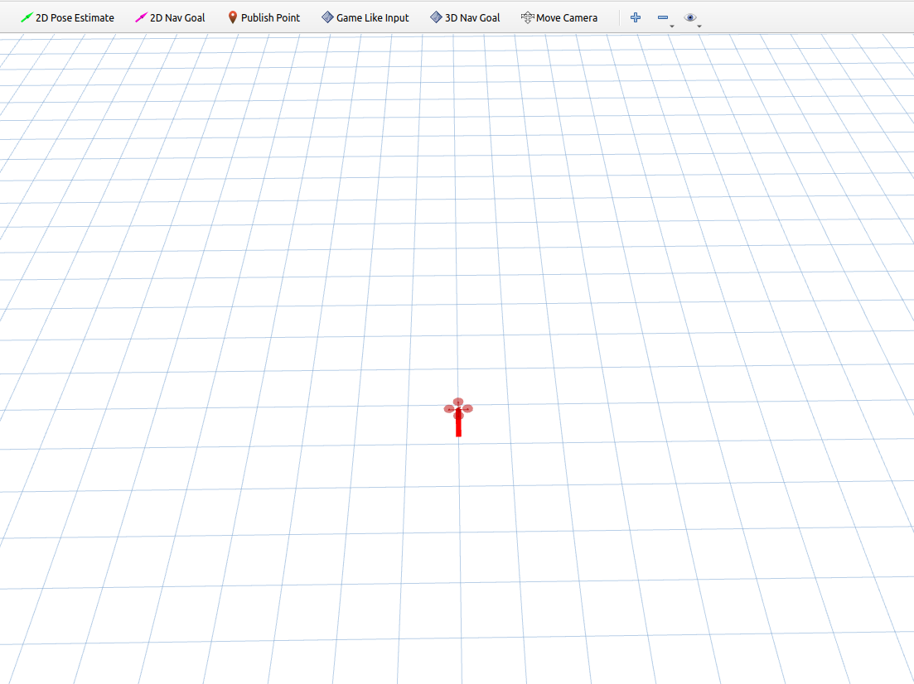

# Dsp-map-simulator
A uav simulator for dsp-map. If you have any questions, please ask in the "issues" section.

# Description
This repository mainly contains the following modules: 

(1) To construct dynamic and static maps, please refer to the section on [Building simulation maps](#building-simulation-maps). 

(2) To test [DSP-MAP](https://github.com/g-ch/DSP-map), please refer to the [Testing DSP-MAP](#testing-dsp-map). 

(3) To conduct drone planning simulations, please refer to the [Planning in simulation](#control-simulation).


# Compile
__Tested environment__: Ubuntu 18.04 + ROS Melodic and Ubuntu 20.04 + ROS Noetic

This document includes DSP-MAP, therefore it requires some components of dsp-map. For the configuration of dsp-map, please refer [DSP-MAP](https://github.com/g-ch/DSP-map). If you do not wish to use dsp-map and only want to use the simulator, you can delete the dsp-map folder from the source package and compile without it.

1.Download and compile the repo

    ```
    mkdir -p uav_simulator_ws/src
    cd uav_simulator_ws/src
    git clone https://github.com/SmartGroupSystems/Dsp-map-simulator
    cd ..
    catkin_make
    ```

2.Test

    ```
    cd uav_simulator_ws
    source devel/setup.bash
    roslaunch roslaunch so3_quadrotor_simulator simulator_example.launch
    ```

Then you can see a uav like this:



# Building Simulation Maps

# Testing DSP-MAP

# Control simulation